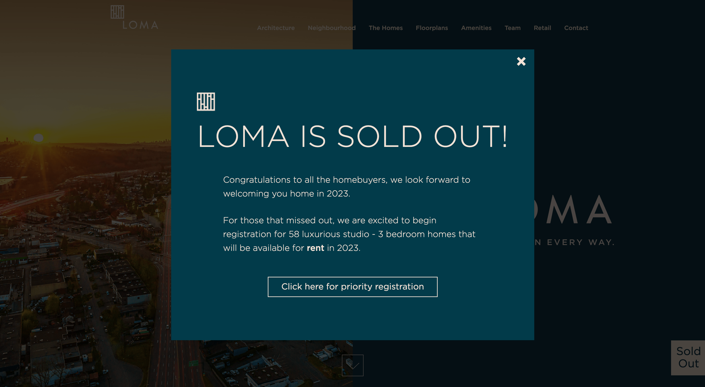

# Popup modal with Pure CSS and JS

Popup modal that covers the page with background overlay.
Close button sets [sessionStorage](https://developer.mozilla.org/en-US/docs/Web/API/Window/sessionStorage) that sets and check the data `popup_session` so that the modal won't be appeared if this data is set to `hide`.
Open button clears the data `popup_session` to open the modal again. 

## How to Install and Run on Local
Open a new Visual Studio Code and install the all files in the same root folder: 

*or* 

Clone this snippet.

Run [Live Sass Compiler](https://marketplace.visualstudio.com/items?itemName=glenn2223.live-sass) in order to compile `sass` to `css`.

Run [Live Server](https://marketplace.visualstudio.com/items?itemName=ritwickdey.LiveServer) to launch a local development server.

## How to Apply
Add complied `style.css` and `index.js` in proper location like header, footer, or before closing body tag.
Some WordPress projects which use 3rd party theme/builder, I would install [Insert Headers And Footers plugins](https://wordpress.org/plugins/wp-headers-and-footers/) to add my custom codes easily without editing the theme.

---
##### created by Grace Cho on Sep26, 2022